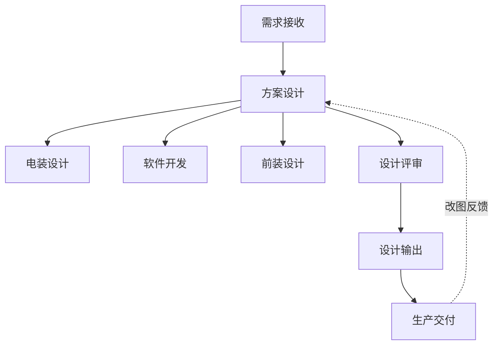

# 核心价值链 5 中心业务流程地图

> 本文档是**机会挖掘的目标地图**：把 5 个核心价值链中心的业务流程拆解到节点级别，让挖掘时知道"哪里可能有 AI / 软件替代空间"。
>
> **🚨 总纲：业务事实（docs/business-context.md + 岗位职责说明书）是最高依据。**
> 流程描述分三层：
> - **主来源 = 流程职能本质**（这个流程节点本身干什么）→ 决定【是不是个真流程】。
> - **领域语境 = 业务事实**（business-context.md）→ 决定【跨部门如何联动】。
> - **印证 = 岗位职责说明书**（实际岗位的日常工作描述）→ 决定【流程节点的执行细节】。
>
> **流程节点 ≠ 岗位**。一个流程节点可能跨多个岗位协作；一个岗位可能参与多个流程节点。
>
> 痛点线索标记 **🔴**：表示已知痛点，挖掘时优先深挖。
> 潜在机会标记 **🟡**：表示流程本身存在 AI / 软件替代可能，但需进一步验证。

---

## 一、装备技术研究中心（29 人 · 装备研发）

### 业务定位

按电池研发中心提出的工艺需求，把"造什么设备、怎么造"用图纸/电装/软件/前装的方式设计出来。**标准设备**走现成方案复用，**定制设备**走改图重设计。

### 流程地图

```
[1] 需求接收
     │  来源：电池研发中心（提出工艺需求）、产线策划（提出整线设备需求）、客户（通过销售反馈的定制需求）
     │  输入：工艺参数 / 设备规格 / 客户定制点
     │  输出：需求文档（结构化程度不一）
     │  🔴 已知痛点：客户/销售传递的需求经常是"口语化描述"，需要工程师反复对齐
     ▼
[2] 方案设计（机械）
     │  干什么：出整机结构图（外壳/把手/旋钮/传动等）
     │  工具：CAD（SolidWorks / AutoCAD）
     │  🟡 潜在机会：定制设备重复出图、相似结构复用率低
     ▼
[3] 电装设计
     │  干什么：电路板排布、传感器/执行器接线
     │  工具：EDA
     │  🟡 潜在机会：BOM 自动生成、接线图辅助设计
     ▼
[4] 软件开发
     │  干什么：设备控制软件、HMI、数据采集
     │  🟡 潜在机会：标准软件模块复用、控制逻辑模板化
     ▼
[5] 前装设计
     │  干什么：外观件（外壳/把手/旋钮/标牌）
     │  🟡 潜在机会：3D 渲染快速给客户确认
     ▼
[6] 设计评审（内部）
     │  干什么：设计合理性评估，识别机加工/采购需求
     │  🔴 已知痛点：评审纪要散落在邮件/会议纪要里，追溯难
     ▼
[7] 设计输出
     │  产出：BOM + 图纸 + 软件 + 工艺文件
     │  输出给：生产交付中心（按图装配）、采购中心（按 BOM 采购）
     │  🔴 已知痛点：图纸版本管理靠人，定制设备改图频繁后容易版本错乱
     ▼
[8] 定制设备改图（循环）
     │  🔴 已知痛点：改图频繁，每次都要走完整设计流程，重复劳动
```

### 关键概念

- **标准设备 vs 定制设备**：标准是已研发好的现成产品；定制需要改图重设计。**定制比例越高，AI / 软件替代价值越大**（重复劳动多）。
- **设计版本管理**：定制改图频繁 → 版本错乱是高频痛点。

---

## 二、电池研发中心（27 人 · 电池工艺研发）

### 业务定位

用现有设备（自家造的或外采的）做实验，探索电池制造工艺：选材料、确定转速/温度等参数，找最适配设备的最优方案。**正常情况用现有设备找最优方案；现有方案不满足时，提需求给装备研发造新设备。**

### 流程地图

```
[1] 工艺假设
     │  干什么：根据客户需求/研究方向，提出工艺假设（用什么材料/参数）
     │  输入：客户电池规格、研究方向
     │  🔴 已知痛点：假设依据主要靠工程师经验，知识沉淀在个人脑子里
     ▼
[2] 实验设计
     │  干什么：设计实验方案（DOE 设计、参数范围、对照组）
     │  🟡 潜在机会：DOE 方案推荐、参数空间智能搜索
     ▼
[3] 实验执行
     │  干什么：上机实验、采集数据
     │  工具：实验设备（自家造的固态电池设备）、数据采集软件
     │  🔴 已知痛点：实验数据散落在不同设备、不同人手里，整合难
     ▼
[4] 数据分析
     │  干什么：分析实验结果、对比参数、识别最优
     │  🟡 潜在机会：自动生成对比报告、参数敏感性分析
     ▼
[5] 工艺方案输出
     │  产出：电池制造工艺方案（材料/参数/设备组合）
     │  输出给：装备研发（设备需求）、客户（最终交付的工艺方案）
     │  🔴 已知痛点：方案文档靠工程师手写，复用率低
     ▼
[6] 知识沉淀（应做未做）
     │  干什么：把实验结果、工艺方案结构化沉淀到知识库
     │  🔴 已知痛点：实验报告/工艺方案散落在个人电脑/共享盘里，检索难
```

### 关键概念

- **DOE（Design of Experiments）**：实验设计方法论。可以用 AI 优化。
- **实验数据 = 公司核心资产**：电池研发中心的实验数据是公司最值钱的知识资产之一。
- **工艺方案 = 客户交付物之一**：和设备一起交付给客户，所以方案质量直接影响客户体验。

---

## 三、生产交付中心（21 人 · 装配/发货）

### 业务定位

按装备研发的图纸装配设备，按时发货给客户。**目前装配时常自行改动设计（已知痛点），导致同型号设备内部不一致**。

### 流程地图

```
[1] 装配任务接收
     │  干什么：拿到订单 + 装备研发的设计图纸
     │  输入：BOM + 图纸 + 客户要求
     │  🔴 已知痛点：图纸版本核对靠人，容易拿错版本
     ▼
[2] 物料齐套检查
     │  干什么：对照 BOM 检查物料是否齐全
     │  🟡 潜在机会：自动齐套检查（系统对接采购/仓库）
     ▼
[3] 装配执行
     │  干什么：按图装配
     │  🔴 **核心已知痛点**：装配时常自行改动设计（"现场改一下"），同型号设备内部不一致
     │  🔴 已知痛点：装配过程无实时记录，质量追溯困难
     ▼
[4] 装配问题反馈
     │  干什么：装配中发现的设计问题反馈给装备研发
     │  🔴 已知痛点：反馈路径长（装配→主管→装备研发），经常靠"叫过来看一眼"
     ▼
[5] 出厂检验
     │  干什么：按 SOP 检验
     │  🔴 已知痛点：检验标准散落、不一致
     ▼
[6] 包装发货
     │  干什么：打包、装箱、物流安排
     │  🟡 潜在机会：发货状态实时同步给客户
     ▼
[7] 现场装配（客户侧，部分设备需要）
     │  干什么：在客户场地安装、调试
     │  🔴 已知痛点：现场问题反馈给装备研发的链路慢
```

### 关键概念

- **装配一致性 = 质量命脉**：装配擅自改动设计是公司的核心质量风险。
- **设计-装配断层**：装备研发的设计意图在装配环节走样，是流程问题不是人的问题。

---

## 四、产线策划设计中心（12 人 · 整线集成）

### 业务定位

按客户场地 + 技术要求，设计整条产线的设备组成与排布方案。**判断每台设备用标准还是定制**，**多台设备串成一条完整产线**，整体交付客户（金额常达千万级）。

### 流程地图

```
[1] 客户需求接收
     │  来源：销售中心（前线谈客户）
     │  输入：客户技术要求、场地信息、产能需求、预算
     │  🔴 已知痛点：客户需求经常是"模糊描述"，需要工程师结构化翻译
     ▼
[2] 现场勘察（部分项目）
     │  干什么：到客户场地看实际条件（电力/供水/空间/物流）
     │  🟡 潜在机会：现场照片/视频结构化提取信息
     ▼
[3] 设备选型决策
     │  干什么：每台设备用"标准设备"还是"定制设备"
     │  输入：客户需求 + 现有标准设备库
     │  🟡 潜在机会：基于历史项目库的选型推荐
     ▼
[4] 定制设备需求回流
     │  干什么：需要定制的设备，提需求给装备研发改图
     │  🔴 已知痛点：需求传递过程中信息丢失
     ▼
[5] 产线布局设计
     │  干什么：设备排布、物流路径、人流通道
     │  🟡 潜在机会：自动布局（基于场地尺寸 + 设备规格）
     ▼
[6] 多设备兼容性检查
     │  干什么：节拍匹配、接口对接、物料流转
     │  🔴 已知痛点：靠经验 + 多次会议对齐
     ▼
[7] 报价 / 方案输出
     │  产出：整线方案 + 报价 + 工期
     │  输出给：销售中心（给客户）、PMOC（项目立项）
     │  🔴 已知痛点：报价耗时（要拉通多部门数据）
     ▼
[8] 项目交接
     │  输出给：PMOC 项目经理（统筹整线交付）
```

### 关键概念

- **整线项目 = 公司最高金额业务**：千万级订单，方案质量直接影响中标率。
- **整线集成 ≠ 单台设备研发**：产线策划站得更高，看"多台设备如何串成一条线"。
- **产线策划 / 装备研发边界**：产线策划判断"用标准还是定制"；具体标准设备的图纸在装备研发，定制设备的改图也在装备研发。

---

## 五、质量管理中心（11 人 · 横向约束）

### 业务定位

出工艺指导书 / SOP / QMS，**约束生产不走样**，解决"装配不按研发图来"的标准化问题。**横向跨部门**，不专属某条价值链。

### 流程地图

```
[1] 质量标准制定
     │  干什么：基于行业标准 + 公司实际，制定 SOP
     │  输入：装备研发的设计输出、行业标准（ISO 等）、客户特殊要求
     │  🟡 潜在机会：基于历史 SOP + 设计变更自动更新
     ▼
[2] 检验规范制定
     │  干什么：出厂检验 / 进货检验 / 过程检验的检查项
     │  🟡 潜在机会：检验项与 BOM/图纸自动关联
     ▼
[3] SOP 培训
     │  干什么：给生产交付中心做 SOP 培训
     │  🔴 已知痛点：培训后落地效果无追踪
     ▼
[4] 装配一致性稽核
     │  干什么：现场检查装配是否按 SOP 来
     │  🔴 **核心痛点**：稽核频次低、人手不足，问题发现滞后
     ▼
[5] 质量问题根因分析
     │  干什么：出现质量问题时找根因（鱼骨图、5 Why）
     │  🟡 潜在机会：跨项目质量数据聚合分析
     ▼
[6] 持续改进
     │  干什么：SOP 迭代、设备改图建议
     │  🟡 潜在机会：质量数据反哺装备研发（设计源头改进）
```

### 关键概念

- **质量是横向约束**：质量管理跨装备研发、生产交付、采购等多个中心。
- **质量管理的痛点根源**：装配一致性（生产交付问题）→ SOP 难落地（质量管理问题）→ 设计源头（装备研发问题）。**三中心连环痛点，必须一起解**。

---

## 六、跨中心痛点地图（第一轮重点挖掘方向）

> 一些痛点**不是单中心能解决的**，需要跨中心协作。这类机会价值通常更大。

| 痛点 | 涉及中心 | 描述 | 优先级建议 |
|---|---|---|---|
| **装配一致性** | 装备研发 → 质量管理 → 生产交付 | 装配擅自改设计，SOP 难落地，同型号设备不一致 | **🔴 Top 1** |
| **设计-装配断层** | 装备研发 ↔ 生产交付 | 设计意图在装配环节走样，反馈链路慢 | **🔴 Top 2** |
| **需求结构化** | 销售 → 产线策划 / 装备研发 | 客户/销售的需求是口语化描述，反复对齐 | 🟡 Top 3 |
| **实验数据散落** | 电池研发中心 | 实验数据散落在不同设备/人，整合难 | 🟡 Top 4 |
| **图纸版本管理** | 装备研发 | 定制改图频繁后版本错乱 | 🟡 Top 5 |
| **报价耗时长** | 产线策划 → 采购 | 拉通多部门数据，报价慢 | 🟡 Top 6 |
| **需求-物料规格断层** | 装备研发/电池研发/生产交付 → 采购 | 需求部门给的口语化描述，采购反复翻译 | 🟡 Top 7 |
| **BOM 数据散落** | 装备研发 ↔ 采购 | 设备 BOM 没有系统化库，靠 Excel 维护 | 🟡 Top 8 |
| **供应商信息分散** | 采购 → 各需求部门 | 供应商分级、绩效、价格分散在个人手里 | 🟡 Top 9 |

---

## 七、流程图渲染约定（后续可视化用）

如需画流程图，建议用 Mermaid（轻量、文本可读）：



可视化产出可用 `visual-page` skill 渲染成 HTML。

---

## 八、采购中心（13 人 · 支撑：物料/供应链/仓储）

> ⚠️ **用户指定优先从采购下手**，本章节为补充加入。采购中心是**支撑中心**，承接全公司各部门（装备研发、电池研发、产线策划、生产交付）的物料/设备采购需求。**采购人员统一隶属采购中心**，内部自行划分专业方向（战略/技术/定制件/标准件/电商/仓储）。
>
> 4 个核心岗位：采购中心负责人（CPO）/ 供应链管理经理 / 技术采购及生产物料管理专家 / 仓库管理员。

### 业务定位

统筹公司全品类采购（核心设备、原材料、零部件、外协服务），承接研发/生产/产线/质量等多部门需求。**JD 关键 KPI**：
- 采购成本同比下降 12-15%
- 质量提升 20% 以上
- 库存周转天数控制在 15-20 天内
- 采购周期缩短 25% 以上
- 团队协作效率提升 30% 以上

### 流程地图

```
[1] 需求接收
     │  来源：装备研发（设备/零部件）、电池研发（材料/试剂）、产线策划（整线设备）、
     │       生产交付（装配物料）、AI 3D 事业中心（3D 打印物料）
     │  输入：口语化需求 + BOM（如果有）+ 紧急程度
     │  🔴 **核心痛点**：需求部门给的口语化描述，采购反复翻译、反复对齐
     │  🔴 已知痛点：BOM 数据散落（Excel + 邮件），没有系统化库
     ▼
[2] 供应商匹配 / 寻源
     │  干什么：根据需求匹配现有供应商 / 开发新供应商
     │  工具：ERP（用友/金蝶）、SRM（如果有）、Excel 供应商台账
     │  🔴 已知痛点：供应商信息分散（分级、绩效、价格），靠个人脑子记
     ▼
[3] 询价 / 比价
     │  干什么：向多家供应商询价、比价
     │  工具：邮件、Excel、ERP
     │  🟡 潜在机会：智能询价单生成、自动比价
     ▼
[4] 技术评审 + 商务谈判
     │  干什么：技术规格评审、价格谈判、合同条款
     │  工具：会议、合同模板
     │  🔴 已知痛点：合同条款审核靠人工（法务、采购、财务来回沟通）
     ▼
[5] 合同签订 + 履约
     │  干什么：签订合同、跟踪履约进度
     │  🟡 潜在机会：合同履约自动跟踪（到期、付款、交付）
     ▼
[6] 物料跟踪 + 到货预警
     │  干什么：跟踪物料到货、处理交期延误/质量缺陷
     │  工具：ERP、邮件、电话、跟催
     │  🔴 **核心痛点**：物料齐套检查靠人工，缺料预警滞后
     ▼
[7] 入库 + 库存管理
     │  干什么：仓库管理员验收、ERP 入库、库位规划、6S 管理
     │  工具：ERP/WMS、Excel、纸质台账
     │  🔴 已知痛点：盘点靠人工，账卡物一致性核查耗时长
     ▼
[8] 出库 + 物料流转
     │  干什么：根据领料单出库，FIFO 原则
     │  🔴 已知痛点：出库数据实时同步靠人工
     ▼
[9] 成本核算 + 付款
     │  干什么：物料成本核算、应付账款审核、与财务对账
     │  工具：ERP、Excel
     │  🟡 潜在机会：成本自动核算、付款自动提醒
     ▼
[10] 供应商绩效评估
     │  干什么：定期评估供应商绩效（交付、质量、价格、服务）
     │  🟡 潜在机会：绩效自动评分（基于 ERP 数据）
     ▼
[11] 数据报表 + 决策支持
     │  干什么：采购成本分析、库存周转率报告、供应商绩效报告
     │  工具：ERP + 大量 Excel
     │  🔴 **核心痛点**：ERP 数据散落在多个模块，靠 Excel 二次加工做报表
```

### 关键概念

- **采购是横向支撑**：承接 5+ 部门需求，**任何研发/生产/产线的痛点都可能传导到采购**。
- **BOM 是采购的核心数据源**：BOM 不准 → 采购错买 → 物料积压或缺料。
- **供应商管理 = 核心资产**：战略供应商-核心供应商-备选供应商三级体系，绩效评估决定了下一轮采购策略。
- **采购数字化落后**：JD 里大量提到"建立 XX 数据库""建立 XX 体系""推动 XX 落地"——**这些"建立"动词暗示了当前缺失**。

### 跨部门联动重点

- **↔ 装备研发**：BOM 准确性、改图带来的物料变更、标准件复用
- **↔ 电池研发**：实验物料（试剂/原料）的快速采购、紧急采购流程
- **↔ 生产交付**：物料齐套、装配缺料预警、来料质量
- **↔ 产线策划**：整线设备选型、报价支撑、定制件采购周期
- **↔ 质量管理**：来料检验、不合格品退换、供应商质量改进
- **↔ 财务**：付款审核、应付账款周期、预算控制

---

## 九、调整说明（2026-07-01）

- 采购中心**不在最初的核心价值链 5 中心范围**，用户（管理层）优先指定从采购下手，已补充加入。
- 后续扫描顺序调整：采购 → 装备研发 → 电池研发 → 生产交付 → 产线策划 → 质量。
- AI 3D 事业中心、销售中心、PMOC、财务、HR、品牌、行政运营等中心暂不在第一轮扫描范围。